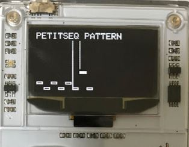

# petitseq
petitseq is petit size sequencer for Arduboy ( https://www.arduboy.com/ )

- 6 patterns
- 8 tracks * 2 channels

# how to use
This application has some views.

## home view
- choose other view
- press arrow buttons to move and A button to decide
- `p N` (N is 0~5) is pattern view
- `TRACK` is track view
- `PARAMS` is params view


## pattern view
- create 8-step pattern
- arrow buttons to move
- A button to put note
- B button to back to home view



## track view
- create music by choosing patterns
- arrow buttons to move
- A button to choose patterns
- B button to back to home view


## choose pattern view
- choose pattern
- up,down buttons to change patterns
- A button to decide and back to track view
- B button to cancel and back to track view

## params view
- change some parameters
- up, down buttons to move
- left, right buttons to change value


# how to compile

compile

```
$ platformio run
```

compile and upload

```
$ platformio run --target upload
```

# Changelog
- 2017/07/09
  - release

